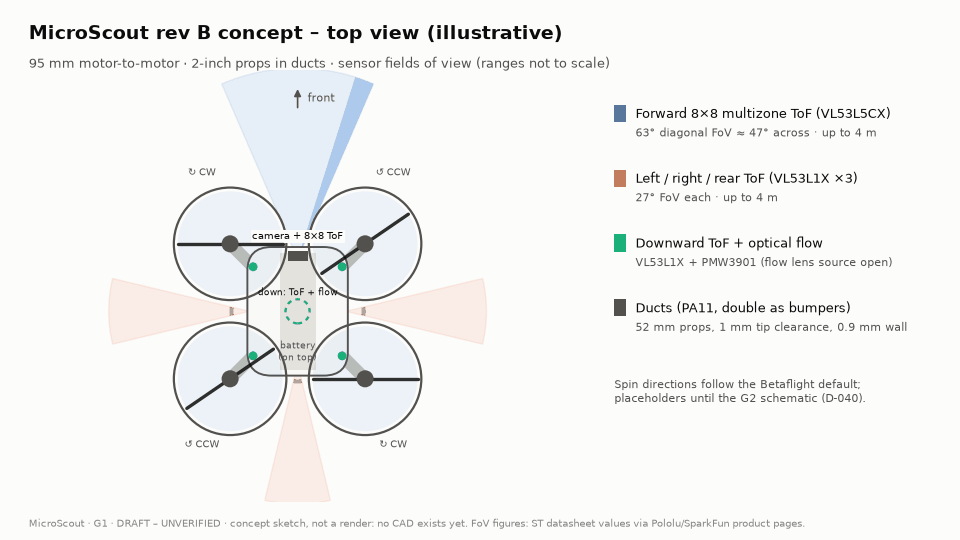
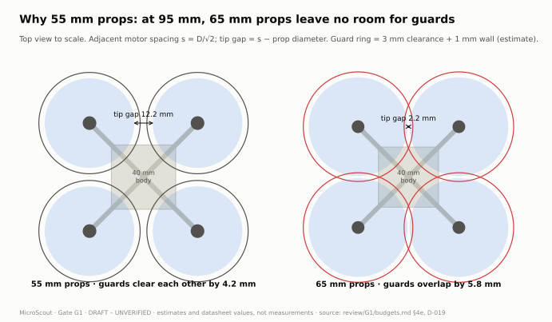

> STATUS: DRAFT - UNVERIFIED - requires human review at Gate G1

# MicroScout

An open-source, palm-sized (~95 mm motor-to-motor), sensor-rich camera quadcopter built around an ESP32-S3: the main PCB is the frame, a 3D-printed canopy carries integrated prop guards, and a Python SDK exposes it for control-theory experiments (PID, LQR, MPC, custom estimators).

> **Project state: Gate G1 (architecture and parts) - drafted, awaiting owner review.** No hardware exists yet. Nothing in this repository has been built, powered, tested or flown. Do not treat any file as a working or safe design.

**[Open the interactive design explorer →](https://normansrule.github.io/microscout/)** Change the takeoff weight, motor thrust, hover efficiency and battery, and watch thrust-to-weight and hover time respond; browse the ESP32-S3 pin map pin by pin.

## Known limitations and required verification

This project is drafted with an AI agent and verified by a human at eight gates (see `VERIFY.md`). The agent cannot produce or confirm:

- Physical testing of any kind: power-up, sensor readings, motor spin, flight, battery charging, thermal behavior, camera streaming, radio range.
- Real-time part availability and pricing, unless live LCSC/JLCPCB access works in this session. Otherwise all stock and prices are UNCONFIRMED.
- Footprint-to-part correctness: the agent can pick library footprints but cannot guarantee they match the exact purchased part's datasheet land pattern, pin 1 orientation, or package variant.
- Pin assignment conflicts on the ESP32-S3: strapping pins, pins used by octal PSRAM and flash (for example GPIO 33-37 on R8 modules), USB pins, and input-only or boot-sensitive pins. The agent drafts a pin table; the human confirms it against the exact module datasheet.
- Quality PCB layout: autorouted traces pass DRC but may be electrically poor. The agent cannot verify RF performance, antenna keep-out effectiveness, USB differential pair quality, ground return paths, EMI, IMU vibration and noise, or motor-current heating.
- Analog and power design correctness: charger, buck/boost, and protection component values must be checked against each IC's datasheet reference design.
- Fabrication file correctness: Gerber appearance, drill alignment, and especially JLCPCB CPL component rotations, which commonly come out wrong and must be checked in JLCPCB's assembly preview.
- Availability of manufacturer STEP models: the agent may only link files it has confirmed exist; otherwise it provides datasheet dimensions for a simplified model.
- Mechanical fit and print quality: tolerances depend on the human's printer and material; weights are estimates until weighed.
- Firmware behavior on real hardware: it can confirm code compiles, not that drivers, timing, control loops, or failsafes behave correctly. All PID gains are placeholders until tuned.
- Whether esp-drone supports this exact sensor set and simultaneous camera streaming on ESP32-S3 without modification. Treat as UNCONFIRMED until bench-tested.
- Regulatory compliance (FAA or local aviation rules, radio rules), battery safety certification, and license compatibility across reused code and CAD files. The agent drafts guidance only.

Known risks found at G1 (details in `review/G1/README.md`): thrust-to-weight is only ~1.6-2.0 on available data; JST-PH 2.0 is rated below the expected battery current; the ~$75 parts target is likely exceeded; the optical-flow lens and the barometer had no confirmed stock.

## Draft architecture (G1)

| Block | Draft choice |
|---|---|
| Compute + radio | ESP32-S3-WROOM-1-N8R2 (Wi-Fi + BLE, 2 MB quad PSRAM) |
| Camera | OV2640 on a 24-pin FPC, MJPEG over Wi-Fi |
| Sensors | BMI270 IMU, BMP390 barometer, QMC5883P magnetometer, 4x VL53L1X ToF (down/left/right/rear), VL53L5CX 8x8 forward ToF, PMW3901 optical flow, INA226 battery monitor |
| Propulsion | 4x 8520 brushed coreless, 55 mm props, AO3400A low-side drivers |
| Power | 1S 660 mAh, BQ24074 USB-C charger, TPS63802 3.3 V, TPS61023 5 V, LTC2954 soft power, reverse-battery FET, 15 A fuse |
| Control links | ExpressLRS receiver (CRSF), Wi-Fi UDP, BLE, Python SDK |

## Visual overview

Every chart below is generated from the G1 data by `tools/viz/` (see [tools/viz/README.md](tools/viz/README.md)) and shows draft estimates, not measurements.

### The headline risk: thrust margin

<picture><source media="(prefers-color-scheme: dark)" srcset="docs/figures/thrust-to-weight-dark.svg"></picture>

| | |
|---|---|
| <picture><source media="(prefers-color-scheme: dark)" srcset="docs/figures/weight-budget-dark.svg"></picture> | <picture><source media="(prefers-color-scheme: dark)" srcset="docs/figures/flight-time-dark.svg"></picture> |
| <picture><source media="(prefers-color-scheme: dark)" srcset="docs/figures/power-budget-dark.svg"></picture> | <picture><source media="(prefers-color-scheme: dark)" srcset="docs/figures/cost-breakdown-dark.svg"></picture> |
| <picture><source media="(prefers-color-scheme: dark)" srcset="docs/figures/prop-clearance-dark.svg"></picture> | <picture><source media="(prefers-color-scheme: dark)" srcset="docs/figures/esp32-pinout-dark.svg"></picture> |

### How it is meant to boot

| Power-on sequence | ToF sensor re-addressing |
|---|---|
|  |  |

These animations illustrate the planned behaviour of the draft design. Only the labelled times come from datasheets or calculation; real behaviour is checked on the bench, props off, at Gate G6.

## Repository layout

| Path | Contents | Licence |
|---|---|---|
| `hardware/` | KiCad projects (drone, remote), libraries | CERN-OHL-S-2.0 |
| `mechanical/` | CadQuery sources, STEP/STL/3MF | CERN-OHL-S-2.0 |
| `firmware/` | Drone and remote firmware (esp-drone based) | GPL-3.0 |
| `software/` | Python SDK, simulator, notebooks | MIT |
| `bom/` | Bills of materials | CERN-OHL-S-2.0 |
| `docs/` | Guides, `decisions.md`, figures and animations, the GitHub Pages explorer (`index.html`) | CC-BY-SA-4.0 (explorer script MIT) |
| `tools/viz/` | Scripts that regenerate every figure, animation and the explorer | MIT |
| `review/G1`…`G8` | Gate review packages | CC-BY-SA-4.0 |
| `VERIFY.md`, `PROGRESS.md`, `LICENSES.md` | Gate checklists, progress, licence summary | CC-BY-SA-4.0 |

## Quick start

Not available yet - there is no buildable hardware or firmware at G1. Build, flashing and bench bring-up guides arrive with G4-G6.

## Safety

Props off for all bench work. Prop guards on and tethered or netted first flights. Never charge unattended, and charge only through the onboard charger after it passes the G6 bench test. In the US, recreational pilots must pass the free FAA TRUST test ([FAA](https://www.faa.gov/uas/recreational_flyers)); drones under 250 g flown recreationally don't need registration ([FAA](https://www.faa.gov/uas/getting_started/register_drone)). Draft guidance only - rules change and vary by country. Respect privacy when flying with the camera.
