> STATUS: DRAFT - UNVERIFIED - requires human review at Gate G2

<p align="center">
  <picture>
    <source media="(prefers-color-scheme: dark)" srcset="docs/figures/banner-dark.png">
    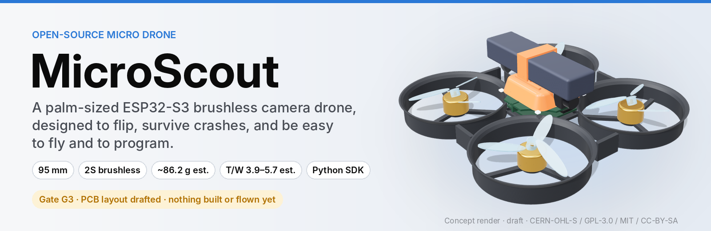
  </picture>
</p>

<p align="center">
  <a href="https://normansrule.github.io/microscout/lab/"></a>
  
  
  <a href="https://github.com/Normansrule/microscout/actions/workflows/checks.yml"></a>
  
  
  
  
</p>

<p align="center">
  <b><a href="https://normansrule.github.io/microscout/lab/">Flight Lab</a></b> ·
  <b><a href="https://normansrule.github.io/microscout/">Design explorer</a></b> ·
  <a href="docs/guide/fly.md">Fly it</a> ·
  <a href="docs/guide/program.md">Program it</a> ·
  <a href="review/G2/README.md">Schematics (G2)</a> ·
  <a href="docs/decisions.md">Decisions</a> ·
  <a href="VERIFY.md">Checklist</a> ·
  <a href="docs/setup-ubuntu.md">Set up on Ubuntu</a>
</p>

> [!WARNING]
> **Nothing here has been built, powered, tested or flown.** MicroScout is drafted by an AI agent and checked by a human at eight gates.
>
> - Gate G1 (architecture and parts) was approved on 2026-10-07.
> - Gate G2 (schematics) is drafted and waiting for review.
>
> The 3D images are a concept model, the flights and the Flight Lab are simulations with estimated parameters, and every number is a datasheet value or an estimate.

## Fly it in your browser: the Flight Lab

<p align="center">
  <a href="https://normansrule.github.io/microscout/lab/?demo=race">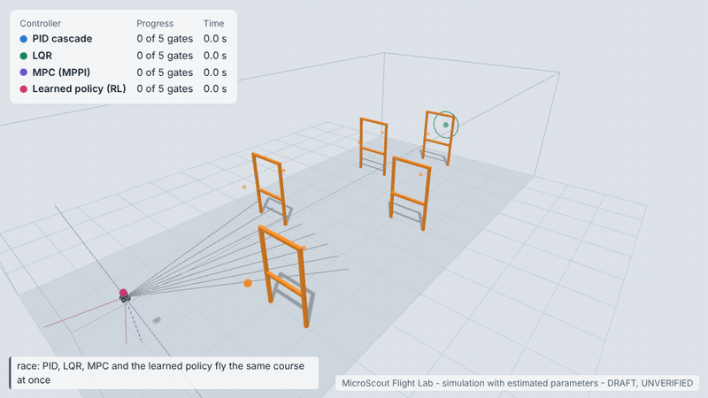</a>
</p>

The **[Flight Lab](https://normansrule.github.io/microscout/lab/)** runs MicroScout's simulator in a web page, with nothing to install:

- **Fly it yourself** with the keyboard, a gamepad or touch sticks, in beginner, sport or acro mode, with one-button flips.
- **Race four autopilots** through obstacle courses: PID, LQR, model-predictive control and a learned policy.
- **Train it with reinforcement learning** using CEM, evolution strategies, ARS or REINFORCE, and watch every attempt as it learns.
- **Make it hard:** add wind, gusts, a weak motor, a payload, noisy sensors or a flat battery.

<table>
  <tr>
    <td width="50%">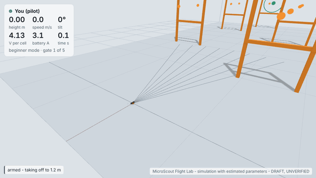<br><sub><b>Free pilot:</b> take off, thread a gate, back flip. The red and grey lines are the 12 simulated ToF rays.</sub></td>
    <td width="50%">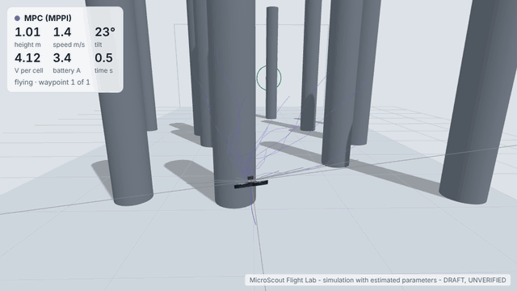<br><sub><b>MPC in the pillar forest:</b> the faint purple lines are the 64 futures it samples every 40 ms.</sub></td>
  </tr>
</table>

<p align="center">
  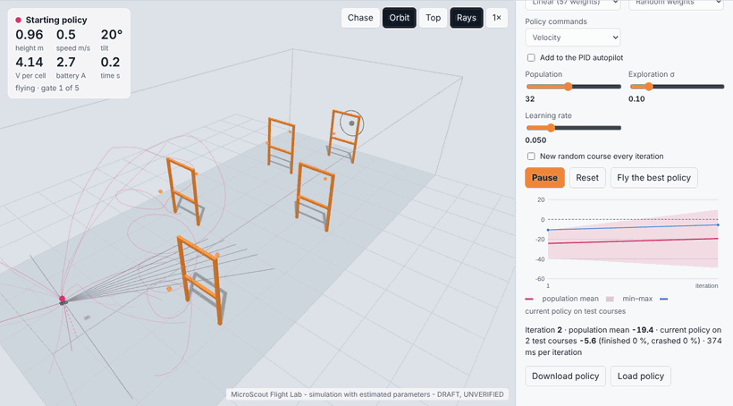
  <br><sub><b>Learning from scratch:</b> the first ~240 iterations of CEM, two per frame. Each faint line is one attempt by a member of the population; the curve on the right is the score.</sub>
</p>

<details>
<summary><b>How the autopilots and the learning algorithms compare</b> (simulation, estimated parameters)</summary>

<picture>
  <source media="(prefers-color-scheme: dark)" srcset="docs/figures/lab-controllers-dark.svg">
  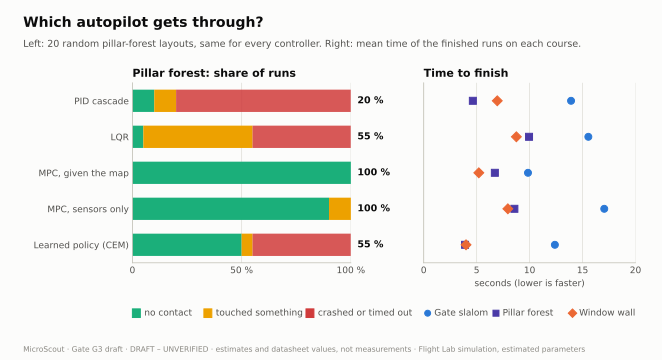
</picture>

<picture>
  <source media="(prefers-color-scheme: dark)" srcset="docs/figures/lab-learning-dark.svg">
  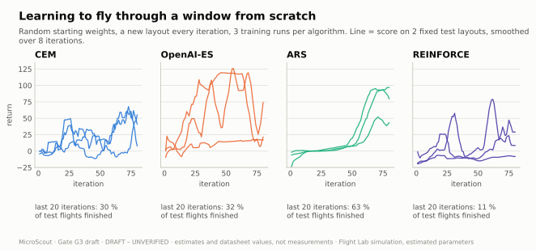
</picture>

MPC wins the forest partly because it is given the obstacle map. The learned policy sees only its 12 ToF rays. Details and caveats are in **[docs/guide/lab.md](docs/guide/lab.md)**.

</details>

## Where the project is

<p align="center">
  <picture>
    <source media="(prefers-color-scheme: dark)" srcset="docs/figures/roadmap-dark.png">
    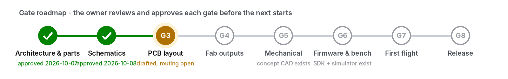
  </picture>
</p>

## At a glance

| ⚡ Quick and agile | 🛡️ Built to take knocks | 🧑‍💻 Easy to fly and program |
|---|---|---|
| 2S brushless (4 × 1103 11000KV), 2-inch props | One-piece ducted nylon (PA11) frame acts as the bumper | Beginner, sport and acro modes, one-button flips |
| Thrust-to-weight **4.0-5.8** (est.) | Electronics soft-mounted on rubber grommets | `drone.takeoff()` / `drone.flip("back")` in Python |
| ~**1000 °/s** rotation, back flip in ~0.8 s (simulated) | Props are the designed weak point; no-solder spares | Same code for the simulator now and the drone later |
| **~84.5 g** with a 550 mAh pack (est.), ~5-6.5 min hover | Hardware low-battery cut-off, current limit in firmware | USB-C charging with balancing; flash over USB without a battery |

**Inside:**

- **Compute and camera:** ESP32-S3 (Wi-Fi + BLE), OV2640 camera.
- **Navigation sensors:** ICM-42688-P IMU, BMP388 barometer, QMC5883P compass, Bitcraze Flow deck.
- **Ranging:** four time-of-flight sensors on small satellite boards.
- **Radio:** ExpressLRS receiver.
- **Motor control:** an open 4-in-1 ESC (electronic speed controller) running AM32 firmware.

## Try it in 30 seconds (simulator)

No install: open the **[Flight Lab](https://normansrule.github.io/microscout/lab/)**. To program it from Python instead:

```bash
git clone https://github.com/Normansrule/microscout.git
cd microscout/software/microscout_sdk && python3 -m venv .venv && source .venv/bin/activate
pip install -e ".[dev]"
microscout demo      # take off, fly a square, turn, back flip, side flip, land
```

```python
import microscout

with microscout.connect("sim") as drone:      # later: microscout.connect("udp://192.168.4.1")
    drone.takeoff(1.0)
    drone.flip("back")
    drone.land()
```

New machine? **[docs/setup-ubuntu.md](docs/setup-ubuntu.md)** covers every command from a fresh Ubuntu terminal: tools, GitHub login, pulling, publishing, the simulator and KiCad's ERC.

## What it looks like (concept)

<table>
  <tr>
    <td width="50%">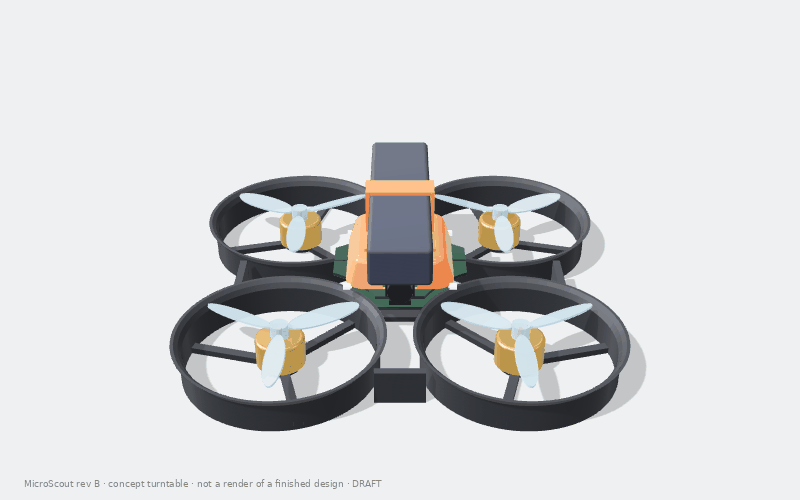</td>
    <td width="50%">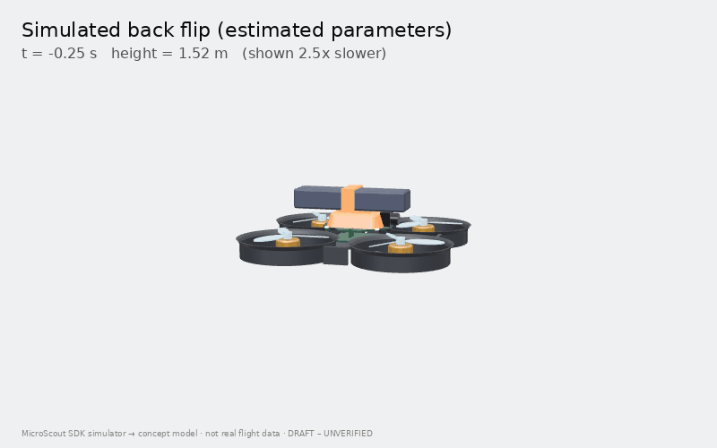</td>
  </tr>
  <tr>
    <td>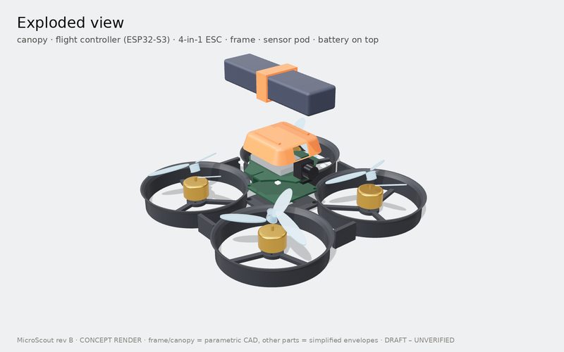</td>
    <td>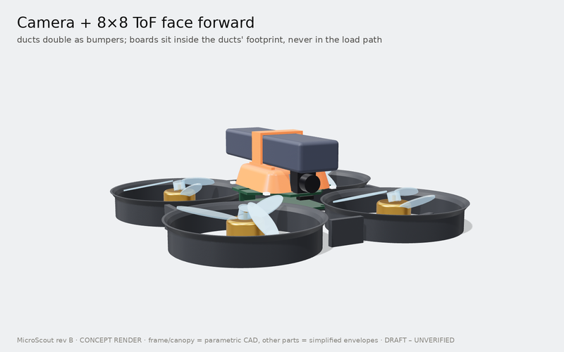</td>
  </tr>
</table>

<sub>Frame and canopy are parametric CadQuery geometry; motors, props, battery, boards and sensors are simplified envelopes. The flip is replayed from the SDK simulator at 2.5× slower. CAD files: <a href="mechanical/concept/">mechanical/concept/</a> (STEP, STL, 3MF, GLB).</sub>

## How it is built

<p align="center">
  <picture>
    <source media="(prefers-color-scheme: dark)" srcset="docs/figures/block-diagram-dark.png">
    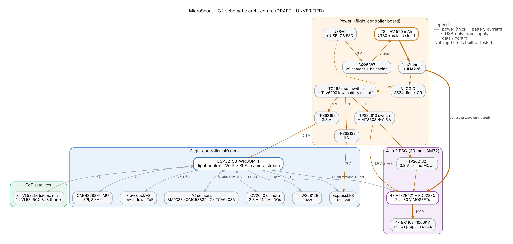
  </picture>
</p>

| Block | Choice (G1 approved, drawn at G2) |
|---|---|
| Compute and radio | ESP32-S3-WROOM-1-N8R2 (Wi-Fi + BLE), ExpressLRS receiver (CRSF) |
| Propulsion | 4 × EX1103 11000KV, 2-inch 3-blade props in ducts; 4-in-1 ESC with 4 × AT32F421 (AM32), FD6288Q drivers on a 9.6 V supply |
| Power | 2S 550 mAh LiHV on XT30; BQ25887 USB-C charger with balancing; 3.3 V and 5 V bucks; soft power switch; INA226 current monitor; hardware low-battery cut-off |
| Sensors | ICM-42688-P, BMP388, QMC5883P, 3 × VL53L1X + VL53L5CX (8 × 8) on satellites, Flow deck v2 |
| Frame | One-piece ducted PA11 frame, TPU canopy and strap, boards on grommets |

## Schematics (Gate G2 draft)

<table>
  <tr>
    <td width="50%"><a href="review/G2/schematics/microscout-fc.pdf">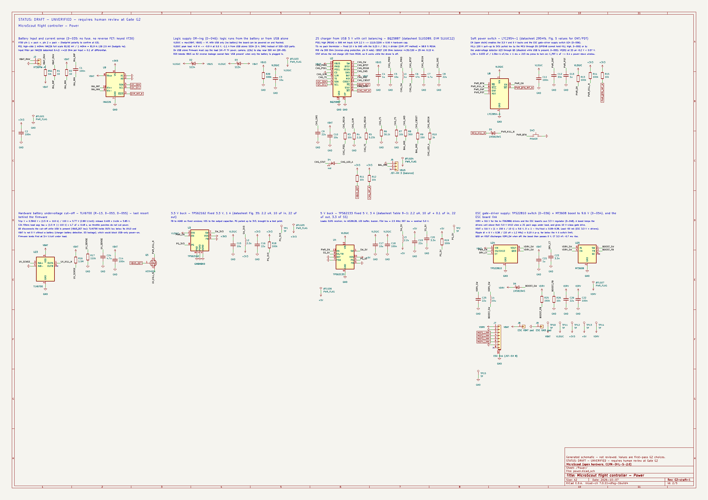</a><br><sub><b>Flight controller</b> - power: charger, soft switch, bucks, cut-off, ESC supply</sub></td>
    <td width="50%"><a href="review/G2/schematics/microscout-esc.pdf">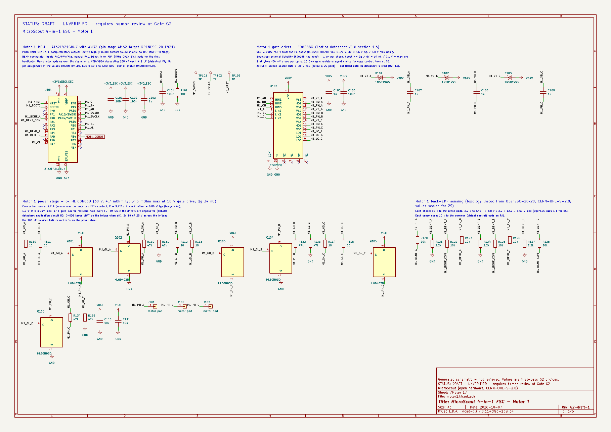</a><br><sub><b>4-in-1 ESC</b> - motor 1: AT32F421 + FD6288Q + 6 MOSFETs + back-EMF sensing</sub></td>
  </tr>
</table>

The schematics are generated from Python by [`tools/sch`](tools/sch/) as KiCad 7 files: the flight controller (4 sheets), the ESC (5 sheets) and two ToF satellite boards.

- **Checks:** the agent's checks report 0 errors, and KiCad's exported netlists are identical to the source.
- **KiCad 9 ERC (run by the owner):** 0 errors. The warnings came from library differences between KiCad versions, so the library parts are now bundled with the project (D-056). Re-running step 6 of the [setup guide](docs/setup-ubuntu.md) should show far fewer.
- **Review:** an independent review pass found 7 serious issues, and all are fixed. They are listed in [review/G2/README.md](review/G2/README.md).

## The numbers (estimates, regenerated from the budget model)

| | |
|---|---|
| <picture><source media="(prefers-color-scheme: dark)" srcset="docs/figures/thrust-to-weight-dark.svg">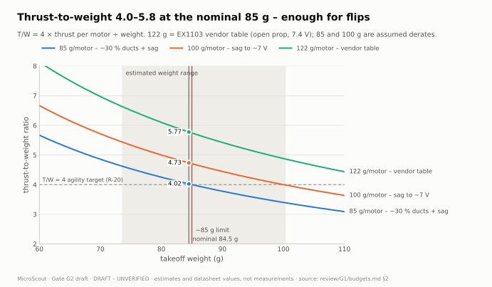</picture> | <picture><source media="(prefers-color-scheme: dark)" srcset="docs/figures/sim-flip-dark.svg">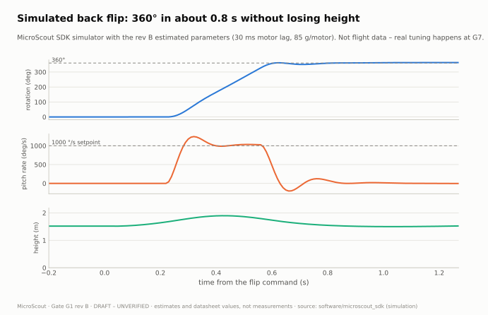</picture> |
| <picture><source media="(prefers-color-scheme: dark)" srcset="docs/figures/weight-budget-dark.svg">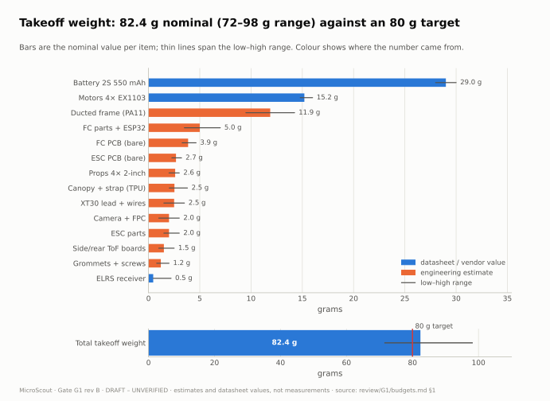</picture> | <picture><source media="(prefers-color-scheme: dark)" srcset="docs/figures/flight-time-dark.svg">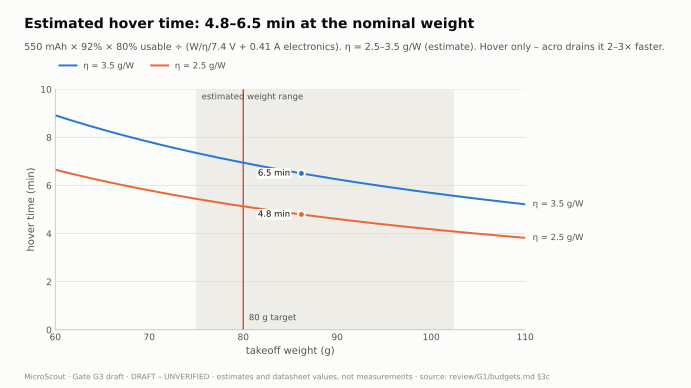</picture> |

<details>
<summary><b>More charts and animations</b>: power, cost, duct layout, pin map, power-on sequence, ToF addressing</summary>

| | |
|---|---|
| <picture><source media="(prefers-color-scheme: dark)" srcset="docs/figures/power-budget-dark.svg">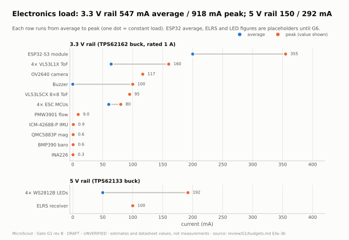</picture> | <picture><source media="(prefers-color-scheme: dark)" srcset="docs/figures/cost-breakdown-dark.svg">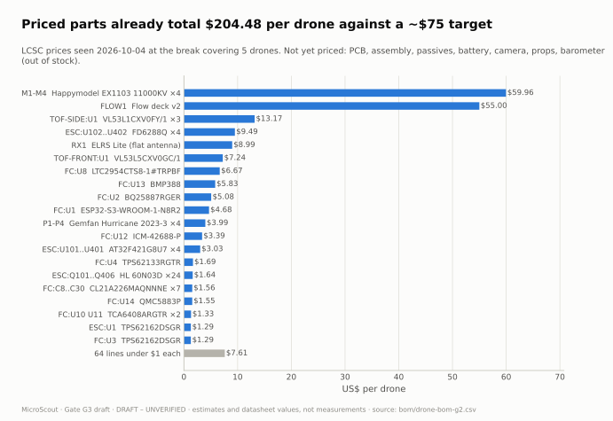</picture> |
| <picture><source media="(prefers-color-scheme: dark)" srcset="docs/figures/duct-layout-dark.svg">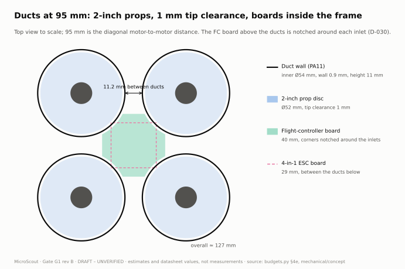</picture> | <picture><source media="(prefers-color-scheme: dark)" srcset="docs/figures/esp32-pinout-dark.svg">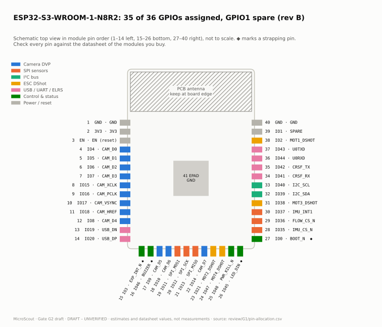</picture> |
| 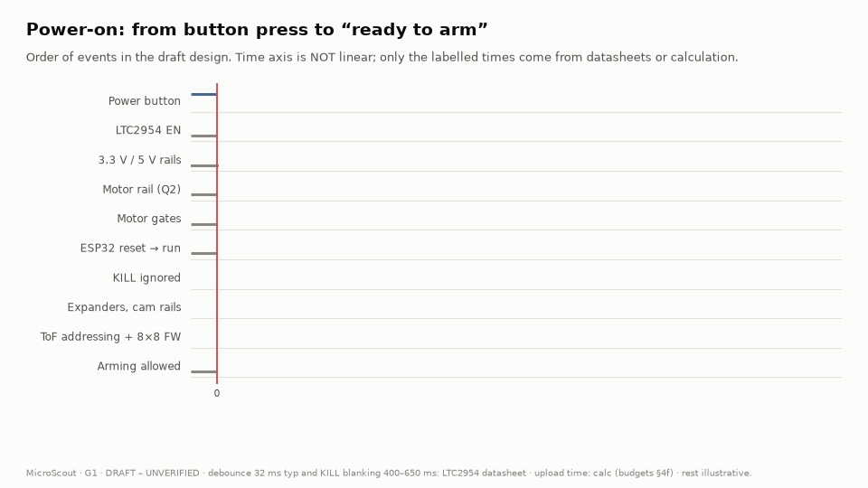 | 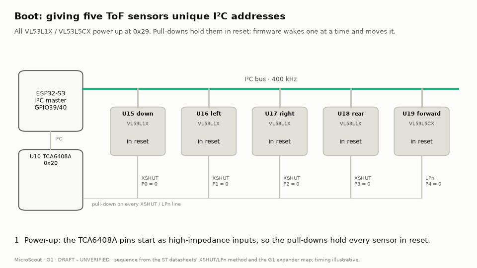 |

</details>

## Project status

| Gate | What the owner reviews | State |
|---|---|---|
| G1 | Architecture, parts, budgets, pin table - [review/G1](review/G1/README.md) | ✅ Approved 2026-10-07 |
| G2 | Schematics, ERC, reference-design checks - [review/G2](review/G2/README.md) | 🟡 Awaiting review (OQ-13 to OQ-18) |
| G3-G4 | PCB layout, fabrication outputs | ⚪ Not started |
| G5 | Mechanical design | ⚪ Concept CAD only |
| G6-G7 | Firmware, bench bring-up, first flight | ⚪ SDK, simulator and Flight Lab built early |
| G8 | Release | ⚪ Not started |

Progress log: [PROGRESS.md](PROGRESS.md). Every design choice and its alternatives: [docs/decisions.md](docs/decisions.md).

Known risks:

- Takeoff weight ~84.5 g against the ~85 g limit.
- The XT30 connector's peak rating is below the full-throttle current, so firmware limits current to 30 A.
- Priced parts come to ~$205 per drone (higher cost accepted).
- Gate-driver stock is uncertain (OQ-13).
- There is no fuse and no reverse-polarity protection.

<details>
<summary><b>What the agent cannot produce or confirm</b> (the human verifies these at the gates)</summary>

- Physical testing of any kind: power-up, sensor readings, motor spin, flight, battery charging, thermal behaviour, camera streaming, radio range.
- Real-time part availability and pricing; stock and prices were seen on given dates and change daily.
- Footprint-to-part correctness: land patterns, pin 1 orientation and package variants must be checked against the purchased parts.
- ESP32-S3 pin conflicts (strapping, PSRAM/flash, USB, boot-sensitive pins), which must be checked against the exact module datasheet.
- PCB layout quality: RF and antenna keep-out, USB pairs, ground returns, EMI, IMU noise, motor-current heating.
- Analog and power design correctness against each IC's reference design.
- Fabrication file correctness, including Gerbers, drills and JLCPCB CPL rotations.
- Manufacturer STEP model availability (simplified envelopes are labelled APPROXIMATE).
- Mechanical fit and print quality; weights are estimates until weighed.
- Firmware behaviour on real hardware; all gains are placeholders until tuned.
- Whether the chosen firmware base supports this sensor set plus camera streaming without changes.
- Regulatory compliance, battery safety certification and licence compatibility; the agent drafts guidance only.

</details>

<details>
<summary><b>Repository layout</b></summary>

| Path | Contents | Licence |
|---|---|---|
| `hardware/` | Schematic sources (`*/design/*.py`), generated KiCad files, project symbol library | CERN-OHL-S-2.0 |
| `mechanical/concept/` | Parametric concept CAD (CadQuery) + STEP/STL/3MF/GLB exports | CERN-OHL-S-2.0 |
| `firmware/` | Drone and remote firmware - from M7 | GPL-3.0 |
| `software/microscout_sdk/` | Python SDK, simulator, reference flight controller, examples, tests | MIT |
| `bom/` | Bills of materials (`drone-bom-g2.csv` is generated from the schematics) | CERN-OHL-S-2.0 |
| `docs/` | Guides, decisions, protocol, figures, renders, the GitHub Pages explorer, setup guide | CC-BY-SA-4.0 (scripts MIT) |
| `docs/lab/` | The Flight Lab: browser simulator, controllers, RL trainers, bundled policies, tests | MIT |
| `tools/sch/`, `tools/viz/` | Schematic generator and checks; every figure, render and the explorer | MIT |
| `review/G1`…`G8` | Gate review packages | CC-BY-SA-4.0 |
| `VERIFY.md`, `PROGRESS.md`, `LICENSES.md` | Gate checklists, progress, licence summary | CC-BY-SA-4.0 |

</details>

## Safety

> [!CAUTION]
> **Unplug the battery after every flight.** The power button switches only the electronics, and there is no fuse or reverse-polarity protection on the battery path (D-035). Use packs with factory-fitted XT30 plugs.
>
> - **Bench work:** props off for all bench work.
> - **First flights:** fly with the ducts on, tethered or netted.
> - **Flips:** only above 1 m, with nobody nearby.
> - **Charging:** never charge unattended. Use the onboard charger only after it passes the G6 bench test.

In the US, recreational pilots must pass the free FAA TRUST test ([FAA](https://www.faa.gov/uas/recreational_flyers)). Drones under 250 g flown recreationally don't need registration ([FAA](https://www.faa.gov/uas/getting_started/register_drone)). This is draft guidance only; rules change and vary by country. Respect privacy when flying with the camera.

## Licences

Hardware is CERN-OHL-S-2.0, firmware GPL-3.0, software MIT, and documentation CC-BY-SA-4.0. Details and third-party notices are in [LICENSES.md](LICENSES.md).
