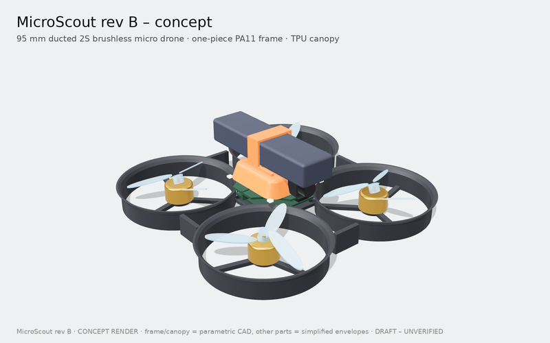
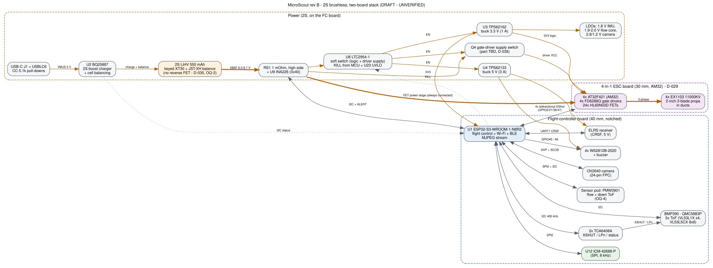

> STATUS: DRAFT - UNVERIFIED - requires human review at Gate G1 (rev B)

# MicroScout

An open-source, palm-sized (95 mm motor-to-motor) quadcopter designed to be **quick, agile enough to flip, tough in crashes, and easy to fly and to program**: 2S brushless motors in a one-piece ducted nylon frame, soft-mounted electronics on an ESP32-S3, a camera with Wi-Fi streaming, five time-of-flight sensors plus optical flow, and a Python SDK that flies a simulator today and is meant to fly the real drone later.

> **Project state: Gate G1 rev B (architecture and parts) - drafted, awaiting owner review.** No hardware exists yet. Nothing here has been built, powered, tested or flown. The 3D images are a concept model and the flights are simulations with estimated parameters.

<p align="center"></p>

**[Open the interactive design explorer →](https://normansrule.github.io/microscout/)** Orbit the 3D concept, replay simulated flips and flights, change weight, thrust and battery assumptions, and browse the ESP32-S3 pin map. *(Live once the repo is public and GitHub Pages is enabled - [docs/publishing.md](docs/publishing.md).)*

| I want to... | Go to |
|---|---|
| Fly it (modes, safety, crashes) | [docs/guide/fly.md](docs/guide/fly.md) |
| Program it (Python SDK, simulator, your own PID/LQR) | [docs/guide/program.md](docs/guide/program.md) |
| Review the design | [review/G1/README.md](review/G1/README.md) and [VERIFY.md](VERIFY.md) |
| See the 3D concept files | [mechanical/concept/](mechanical/concept/) (STEP, STL, 3MF, GLB) |

## Try it in 30 seconds (simulator)

```bash
git clone https://github.com/Normansrule/microscout.git
cd microscout/software/microscout_sdk && pip install -e ".[dev]"
microscout demo      # take off, fly a square, turn, back flip, side flip, land
```

```python
import microscout
with microscout.connect("sim") as drone:      # later: connect("udp://192.168.4.1")
    drone.takeoff(1.0)
    drone.flip("back")
    drone.land()
```

## What it looks like (concept)

| | |
|---|---|
|  |  |
|  |  |

Frame and canopy are parametric CadQuery geometry; motors, props, battery, boards and sensors are simplified envelopes. The flip is replayed from the SDK simulator (2.5x slower).

## Known limitations and required verification

This project is drafted with an AI agent and verified by a human at eight gates (see `VERIFY.md`). The agent cannot produce or confirm:

- Physical testing of any kind: power-up, sensor readings, motor spin, flight, battery charging, thermal behavior, camera streaming, radio range.
- Real-time part availability and pricing, unless live LCSC/JLCPCB access works in this session. Otherwise all stock and prices are UNCONFIRMED.
- Footprint-to-part correctness: the agent can pick library footprints but cannot guarantee they match the exact purchased part's datasheet land pattern, pin 1 orientation, or package variant.
- Pin assignment conflicts on the ESP32-S3: strapping pins, pins used by octal PSRAM and flash (for example GPIO 33-37 on R8 modules), USB pins, and input-only or boot-sensitive pins. The agent drafts a pin table; the human confirms it against the exact module datasheet.
- Quality PCB layout: autorouted traces pass DRC but may be electrically poor. The agent cannot verify RF performance, antenna keep-out effectiveness, USB differential pair quality, ground return paths, EMI, IMU vibration and noise, or motor-current heating.
- Analog and power design correctness: charger, buck/boost, and protection component values must be checked against each IC's datasheet reference design.
- Fabrication file correctness: Gerber appearance, drill alignment, and especially JLCPCB CPL component rotations, which commonly come out wrong and must be checked in JLCPCB's assembly preview.
- Availability of manufacturer STEP models: the agent may only link files it has confirmed exist; otherwise it provides datasheet dimensions for a simplified model.
- Mechanical fit and print quality: tolerances depend on the human's printer and material; weights are estimates until weighed.
- Firmware behavior on real hardware: it can confirm code compiles, not that drivers, timing, control loops, or failsafes behave correctly. All PID gains are placeholders until tuned.
- Whether esp-drone supports this exact sensor set and simultaneous camera streaming on ESP32-S3 without modification. Treat as UNCONFIRMED until bench-tested.
- Regulatory compliance (FAA or local aviation rules, radio rules), battery safety certification, and license compatibility across reused code and CAD files. The agent drafts guidance only.

Known risks found at G1 rev B (details in `review/G1/README.md`): takeoff weight 82 g vs the 80 g target; XT30 peak rating below the full-throttle current (firmware limits to 30 A); priced parts ~$137 vs ~$75; optical-flow lens and barometer stock still open; firmware base for acro undecided.

## Draft architecture (G1 rev B)



| Block | Draft choice |
|---|---|
| Compute + radio | ESP32-S3-WROOM-1-N8R2 (Wi-Fi + BLE) |
| Propulsion | 4x EX1103 11000KV brushless, 2-inch 3-blade props in ducts, separate 4-in-1 ESC board (AM32, 4x AT32F421) |
| Power | 2S 550 mAh LiHV on XT30, BQ25887 USB-C 2S charger with balancing, 3.3 V and 5 V bucks, soft switch for logic, INA226 current monitor |
| Sensors | ICM-42688-P IMU, BMP390 barometer, QMC5883P magnetometer, 4x VL53L1X + VL53L5CX 8x8 ToF, PMW3901 optical flow |
| Camera | OV2640, MJPEG over Wi-Fi |
| Frame | One-piece ducted PA11 frame (PP for production), TPU canopy and strap, boards on grommets |
| Control links | ExpressLRS (CRSF), Wi-Fi UDP, BLE, Python SDK |
| Headline estimates | 82 g · thrust-to-weight 4.1-5.9 · 5-7 min hover · ~1000 °/s rates |

## Visual overview

Every chart is generated from the G1 data by `tools/viz/` and shows draft estimates, not measurements.

| | |
|---|---|
| <picture><source media="(prefers-color-scheme: dark)" srcset="docs/figures/thrust-to-weight-dark.svg"></picture> | <picture><source media="(prefers-color-scheme: dark)" srcset="docs/figures/sim-flip-dark.svg"></picture> |
| <picture><source media="(prefers-color-scheme: dark)" srcset="docs/figures/weight-budget-dark.svg"></picture> | <picture><source media="(prefers-color-scheme: dark)" srcset="docs/figures/flight-time-dark.svg"></picture> |
| <picture><source media="(prefers-color-scheme: dark)" srcset="docs/figures/duct-layout-dark.svg"></picture> | <picture><source media="(prefers-color-scheme: dark)" srcset="docs/figures/power-budget-dark.svg"></picture> |
| <picture><source media="(prefers-color-scheme: dark)" srcset="docs/figures/cost-breakdown-dark.svg"></picture> | <picture><source media="(prefers-color-scheme: dark)" srcset="docs/figures/esp32-pinout-dark.svg"></picture> |

| Power-on sequence | ToF sensor re-addressing |
|---|---|
|  |  |

## Repository layout

| Path | Contents | Licence |
|---|---|---|
| `hardware/` | KiCad projects (drone FC, ESC, remote), libraries - from M2 | CERN-OHL-S-2.0 |
| `mechanical/concept/` | Parametric concept CAD (CadQuery) + STEP/STL/3MF/GLB exports | CERN-OHL-S-2.0 |
| `firmware/` | Drone and remote firmware - from M7 | GPL-3.0 |
| `software/microscout_sdk/` | Python SDK, simulator, reference flight controller, examples, tests | MIT |
| `bom/` | Bills of materials | CERN-OHL-S-2.0 |
| `docs/` | Guides (`guide/`), `decisions.md`, `protocol.md`, figures, renders, the GitHub Pages explorer | CC-BY-SA-4.0 (scripts MIT) |
| `tools/viz/` | Scripts for every figure, animation, render and the explorer | MIT |
| `review/G1`…`G8` | Gate review packages | CC-BY-SA-4.0 |
| `VERIFY.md`, `PROGRESS.md`, `LICENSES.md` | Gate checklists, progress, licence summary | CC-BY-SA-4.0 |

## Quick start

Hardware: not available yet - build, flashing and bench guides arrive with G4-G6. Software: see "Try it in 30 seconds" above.

## Safety

Props off for all bench work. **Unplug the battery after every flight:** the power button switches only the electronics, and there is no fuse or reverse-polarity protection on the battery path (D-035) - use packs with factory-fitted XT30 plugs. Ducts on and tethered or netted first flights; flips only above 1 m and in a space with nobody nearby. Never charge unattended, and charge only through the onboard charger after it passes the G6 bench test. In the US, recreational pilots must pass the free FAA TRUST test ([FAA](https://www.faa.gov/uas/recreational_flyers)); drones under 250 g flown recreationally don't need registration ([FAA](https://www.faa.gov/uas/getting_started/register_drone)). Draft guidance only - rules change and vary by country. Respect privacy when flying with the camera.
