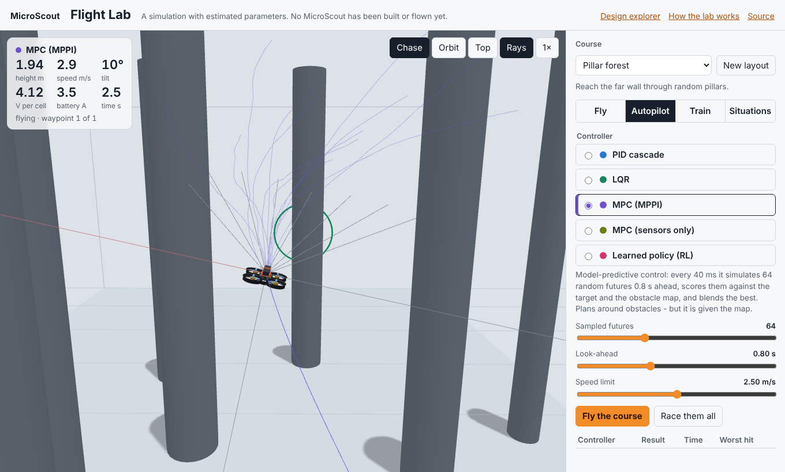
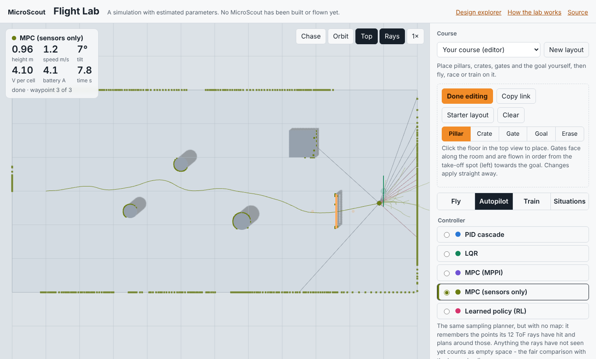

> STATUS: DRAFT - UNVERIFIED - requires human review at Gate G6 (simulation only; no MicroScout has been built or flown)

# The Flight Lab

**Open it:** <https://normansrule.github.io/microscout/lab/>

The Flight Lab is a browser app for trying MicroScout before any hardware exists. You can:

- fly it yourself;
- watch five different autopilots attempt the same obstacle course;
- build your own course and share it as a link;
- train it with reinforcement learning and watch it improve;
- add wind, a weak motor or a flat battery to see what breaks.

Everything runs on your own machine. There is no server and nothing to install.

<p align="center"></p>

> [!WARNING]
> The lab is a simulation. Mass, inertia, thrust, drag and battery behaviour are the G2 estimates from `review/G1/calc/budgets.py`, and nothing has been measured. A policy or tuning that works here is a starting point for Gate G6 bench tests. It is not evidence that the real drone will fly the same way.

## The tabs

| Tab | What you do | What it shows |
|---|---|---|
| **Fly** | Fly it yourself in beginner, sport or acro mode, with take-off, land, flips and a simulated radio drop | The flight modes and safety rules from [fly.md](fly.md), and how they feel |
| **Autopilot** | Pick PID, LQR, MPC (with the map or with sensors only) or the learned policy, tune it, then use *Fly the course* or *Race them all* | How different control ideas cope with the same course |
| **Train** | Pick a learning algorithm, a policy and its settings, then press *Start* | The learning curve, the population's attempts as faint ghost paths, and the current policy re-flying in the view |
| **Situations** | Add wind, gusts, a weak motor 3, a payload, ToF noise or a low battery | Which controllers degrade gracefully and which do not |

### Controls (Fly tab)

| Keys | Action | Keys | Action |
|---|---|---|---|
| <kbd>W</kbd> <kbd>S</kbd> | forward, back | <kbd>A</kbd> <kbd>D</kbd> | left, right |
| <kbd>Space</kbd> <kbd>Shift</kbd> | up, down | <kbd>Q</kbd> <kbd>E</kbd> | turn |
| <kbd>T</kbd> | take off (to 1.2 m) | <kbd>L</kbd> | land |
| <kbd>X</kbd> | flip toward the stick (back flip if centred) | <kbd>1</kbd> <kbd>2</kbd> <kbd>3</kbd> | beginner, sport, acro |
| <kbd>C</kbd> | camera: chase, orbit, top | <kbd>K</kbd> | motors off |

A gamepad also works, using the Mode 2 layout: left stick is throttle and yaw, right stick is pitch and roll. The face buttons are take off, land, flip and mode. On a phone, two touch sticks appear once you take off.

The safety rules are the same as in the SDK simulator:

- **Ceiling:** 3 m, except in acro.
- **Flips:** refused below 1 m.
- **Lost radio:** if no stick packets arrive for 0.5 s, it hovers. After a further 3 s, it lands.
- **Low battery:** it lands by itself.
- **Walls (beginner only):** it stops about 40 cm short of anything its ToF rays see.

## The autopilots

All five autopilots share the same inner loops, ported from the SDK's `sim/fc.py`: rate PID, attitude P and an air-mode mixer. They differ only in how they choose the acceleration that the drone should have next.

| Controller | Idea | What it knows | In the lab |
|---|---|---|---|
| **PID cascade** | Position error sets a velocity. Velocity error sets an acceleration. | Only the next target point | Steady and simple, but flies straight at the target, so it clips pillars |
| **LQR** | Optimal gains for a double-integrator model, from a Riccati equation. You set Q (position error) against R (effort), and the gains update live. | Only the next target point | Smooth. Its default tuning is gentle, so it is slower than PID. |
| **MPC (MPPI)** | Every 40 ms it simulates 64 random futures 0.8 s ahead, scores them against the target and an obstacle map, and blends the best ones | **The whole obstacle map.** That is privileged information the real drone would not have. | Best through the forest, because it can see the map |
| **MPC (sensors only)** | The same planner, but its map is only the points its ToF rays have hit so far (a hash grid of up to 3000 points, drawn as dots). Space it has not seen counts as empty. | Only its own sensors, like the learned policy | Finished all 20 forest layouts, 18 of them without contact, but slower: it flies at 1.3 m/s because it only sees ±22.5° ahead |
| **Learned policy** | A linear or small neural-network policy trained in the Train tab | Only its own sensors: 12 ToF rays, its velocity and the direction to the next target | Fast. Good on the courses it trained on, less reliable on new forest layouts |

Why 1.3 m/s for the sensor-only planner: a sweep over 20 forest layouts finished 11, 19 and 20 of them at 2.5, 1.8 and 1.3 m/s. Turning the drone to look along its velocity, instead of at the target, made no real difference. Seeing less means flying slower.

Results of each autopilot on 20 random layouts (`node docs/lab/test/compare.mjs`; simulation only):

<picture>
  <source media="(prefers-color-scheme: dark)" srcset="../figures/lab-controllers-dark.svg">
  
</picture>

## Reinforcement learning

### What the policy sees and does

The policy observes 18 numbers, all in the drone's heading frame:

- the direction to the next target, capped at 3 m;
- its velocity;
- 12 ToF distances: an 8-ray forward fan across ±22.5°, plus left, right, rear and down. These are scaled so that 0 means nothing within 4 m and 1 means touching.

It outputs 3 numbers in the range −1 to 1. By default these are a velocity command (up to 2.5 m/s horizontal and 1.5 m/s vertical), which the drone's own velocity loop then follows. *Acceleration* mode skips that loop and is much harder to learn.

### Reward

The reward is given every 40 ms:

| Event | Reward |
|---|---|
| Each metre of progress toward the current target | +5 |
| Each waypoint or gate reached | +10 |
| Finishing the course | +20, plus 2 per second left on the clock |
| Every step (time cost) | −0.02 |
| Each m/s of impact speed | −2 |
| Crash (impact over 0.6 m/s, tilt over 70°, or on the floor after 1 s) | −20, and the episode ends |

### Algorithms

| Algorithm | How it learns | Good for |
|---|---|---|
| **Cross-entropy method (CEM)** | Samples a population around a mean policy, keeps the best 20 % and refits the mean and spread | The default: robust, no gradients |
| **Evolution strategies (OpenAI-ES)** | Mirrored random perturbations and rank-normalised returns give a gradient estimate. Each update is an Adam step. | Larger networks. In our runs it reached a finishing policy early, then often lost it again. |
| **Augmented random search (ARS)** | Like ES, but uses only the best perturbation directions and scales the step by their spread | Linear policies. It had the best final scores in our from-scratch runs. |
| **REINFORCE** | Gaussian noise on the actions; raises the log-probability of actions that beat the average | Showing how a per-step policy gradient behaves. Noisier here. |

### Settings

| Setting | Options |
|---|---|
| Policy | Linear (57 weights) or a neural network 18-24-3 (531 weights) |
| Start from | A simple PD steering rule, or random weights |
| Residual | *Add to the PID autopilot* makes the policy learn a correction on top of PID |
| Population, exploration σ, learning rate | Adjustable |
| *New random course every iteration* | On by default; makes the policy generalise instead of memorising one layout |

Training runs in a Web Worker, so the view stays smooth. Use *Download policy* and *Load policy* to keep a policy you like or to share it.

### Bundled policies

The policies the Autopilot tab uses for *Learned policy* were trained offline with the same code:

```bash
node docs/lab/train.mjs '{"course":"forest","trainer":"cem","arch":"linear","init":"pd","population":32,"episodes":2,"randomize":true}' 160 docs/lab/policies/forest-cem-linear.json
```

Each JSON file records its training settings, its learning history, and its score on 20 layouts it never trained on:

| Policy | Unseen layouts finished | Crashed |
|---|---|---|
| Gate slalom | 100 % | 0 % |
| Pillar forest | 70 % | 30 % |
| Window wall | 100 % | 0 % |

The gate policy barely moved from the PD rule it started from, because that rule already finishes the slalom.

<picture>
  <source media="(prefers-color-scheme: dark)" srcset="../figures/lab-learning-dark.svg">
  
</picture>

The chart above comes from `node docs/lab/test/curves.mjs` (three seeds, 80 iterations each, with random starting weights). Two things stand out:

- Results vary a lot between seeds.
- Starting from the PD steering rule, as the bundled policies do, is much more reliable than starting from random weights.

Three runs per algorithm are too few to rank the algorithms. Treat the chart as a picture of how noisy RL is, not as a benchmark.

## Situations to try

The results in the second column come from single runs of the lab's own simulator, done while writing this page. Expect different numbers on other layouts and seeds.

| Situation | What happened when we tried it |
|---|---|
| *Hold in gusts* with 3 m/s wind and 1.5 m/s gusts | All three model-based controllers held the point. Worst drift: PID 0.37 m, LQR 0.50 m, MPC 0.67 m. |
| Motor 3 at 60 % on the gate slalom | PID still finished. LQR and MPC timed out: their gentler commands could not make up for the weak corner. |
| ToF noise of 10 cm on the pillar forest (20 layouts) | No change for the map-based MPC (20 of 20), the sensor-only MPC (20 of 20) or the learned policy (9 of 20). The learned policy's misses come from elsewhere, so this is a good thing to train on. |
| Battery at 15 % in the Fly tab | The pilot controller lands by itself. |
| *Drop the radio* while flying | It hovers, then lands after 3 s (a regression test checks this). |
| Train with wind on, then fly the result without wind (or the reverse) | Try it. How well a policy carries over is the interesting part. |

## Build your own course

Choose **Your course (editor)** in the course list, then press **Edit layout**. The view switches to a top-down plan.

- Pick **Pillar**, **Crate**, **Gate** or **Goal**, and click the floor to place it. **Erase** removes the nearest item.
- Gates face along the room and are flown in order, from the take-off spot on the left towards the goal.
- The take-off spot stays clear, and everything is clamped inside the room.
- Every tab works on your course: fly it yourself, race the autopilots on it, or train a policy on it.
- The address bar always holds a link to the current layout (`?course=custom#course=...`), and **Copy link** copies it. The layout is also remembered in your browser.

<p align="center"></p>

## How it is built

| File | Role |
|---|---|
| `docs/lab/js/physics.js` | Rigid-body quad: NED world frame, FRD body frame. Motor lag, inflow loss, drag relative to the wind, Ornstein-Uhlenbeck gusts, a battery model, and contacts with restitution. |
| `docs/lab/js/control.js` | Inner loops; the PID, LQR, MPPI and learned controllers; the pilot controller with flips and safety rules |
| `docs/lab/js/rl.js` | Episode runner, reward, and the CEM, ES, ARS and REINFORCE trainers. `worker.js` runs them off the main thread. |
| `docs/lab/js/world.js` | The courses (including the editor's `custom` course), ToF ray casting and collision geometry |
| `docs/lab/js/render.js` | three.js view: the concept model from `docs/models/`, trails, rays, ghosts, MPC samples, the sensor-only MPC's hit points, and an orthographic top view used by the editor |
| `docs/lab/test/lab.test.mjs` | Regression tests, run in CI with `node --test docs/lab/test/lab.test.mjs` |
| `tools/viz/lab_capture.py`, `tools/viz/lab_charts.py` | The README GIFs and charts |

To run it locally, serve the `docs/` folder over HTTP, because ES modules and workers do not load from `file://`:

```bash
cd microscout/docs && python3 -m http.server 8000
# then open http://localhost:8000/lab/
```

### URL options

| Option | Effect |
|---|---|
| `?course=forest` | Chooses the course: `gates`, `forest`, `window`, `hover`, `hangar` or `custom` |
| `#course=...` | A layout from the editor (made by *Copy link*) |
| `&tab=train` | Opens a tab: `fly`, `auto`, `train` or `sit` |
| `&demo=race` | Starts a race |
| `&cam=top` | Sets the camera |
| `&embed` | Shows only the 3D view |

### Known limits

- The real flight controller will run its loops on an ESP32-S3 with sensor noise, estimation error and latency. The lab steps the physics at 500 Hz and gives every controller the true state; only the ToF rays can be made noisy.
- Ground effect, propeller wash between ducts, and battery sag under temperature are not modelled.
- The map-based MPC is given the obstacle map. The sensor-only MPC is the fair comparison, but its ToF model is ideal apart from optional noise: no multipath, no surface reflectivity, and no 8 × 8 zones on the front sensor.
