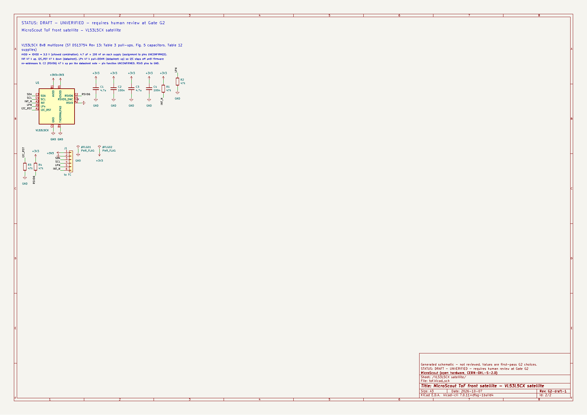

> STATUS: DRAFT - UNVERIFIED - requires human review at Gate G2

# Gate G2 review package - Schematics

<p align="center">
  
  
  
  
</p>

<p align="center">
  <picture>
    <source media="(prefers-color-scheme: dark)" srcset="../../docs/figures/block-diagram-dark.png">
    
  </picture>
</p>

> [!IMPORTANT]
> **To approve:** reply `APPROVED G2`, or send corrections and answers to OQ-13 to OQ-18 below. To run KiCad's own ERC from a fresh Ubuntu terminal, follow [docs/setup-ubuntu.md](../../docs/setup-ubuntu.md#6-regenerate-the-schematics-and-run-kicads-own-erc-g2-checklist), step 6.

| Flight controller | 4-in-1 ESC | ToF satellites |
|---|---|---|
| <a href="schematics/microscout-fc.pdf"></a> | <a href="schematics/microscout-esc.pdf"></a> | <a href="schematics/microscout-tof-front.pdf"></a> |
| [PDF, 4 sheets](schematics/microscout-fc.pdf) | [PDF, 5 sheets](schematics/microscout-esc.pdf) | [front](schematics/microscout-tof-front.pdf) · [side](schematics/microscout-tof-side.pdf) |

G1 rev B was approved on 2026-10-07 (D-044), and milestone M2 is drafted.

> [!NOTE]
> **G2 was approved on 2026-10-08 (D-059).** During layout (G3) the schematics were revised by D-061: battery and balance connectors became pigtail pads, the three buttons became KMR2-footprint switches, the ESC power pads shrank, and the 1.27 mm headers became SMD pad rows. The schematic PDFs and netlists in this folder were regenerated with those changes; the list is in [`review/G3/README.md`](../G3/README.md).

Nothing here has been built, powered or tested. Every value is a first-pass choice checked against a datasheet, or it is marked UNCONFIRMED.

## The boards

| Board | Schematic (PDF) | Sheets | Parts | Source |
|---|---|---|---|---|
| Flight controller (40 mm) | `schematics/microscout-fc.pdf` | Power; MCU and USB; Sensors and expanders; Camera, LEDs, buzzer, receiver | 158 | `hardware/drone-pcb/design/fc.py` |
| 4-in-1 ESC (30 mm, AM32) | `schematics/microscout-esc.pdf` | Power and link; Motor 1-4 | 210 | `hardware/esc-pcb/design/esc.py` |
| ToF side satellite (3 per drone) | `schematics/microscout-tof-side.pdf` | 1 | 5 | `hardware/tof-satellites/design/tof.py` |
| ToF front satellite (1 per drone) | `schematics/microscout-tof-front.pdf` | 1 | 10 | same |

Part counts include test points and wire pads. PNG previews of every sheet are in `docs/figures/schematics/`.

## What is in this package (the brief's G2 list)

| Item | File | Review time |
|---|---|---|
| PDF of all sheets | `schematics/*.pdf` | 30 min |
| ERC report | `check-*.md` (see the ERC note below) | 5 min |
| Netlists (KiCad export) | `netlists/*.net` | - |
| Power and charger circuits vs their datasheet reference designs | `reference-designs.md` | 20 min |
| Pull-up / pull-down and strapping summary | `pullups-straps.md` | 10 min |
| ESD and protection summary | `protection.md` | 10 min |
| Per-board BOMs from the schematics; costed per-drone BOM | `bom-*.csv`; `../../bom/drone-bom-g2.csv` | 10 min |
| Datasheets and pages read | `sources.md` | - |
| Decisions D-044 to D-055 | `../../docs/decisions.md` | 10 min |

**ERC:** KiCad 7 (the version available here, OQ-1) cannot run ERC from the command line; that arrived in KiCad 8. So `tools/sch/check.py` does three things:

- **Its own ERC on the source netlist.** It uses the electrical pin types from the KiCad symbols and checks for:
  - unassigned pins and single-pin nets
  - undriven power inputs and undriven inputs
  - output conflicts and PWR_FLAG conflicts
  - open-drain outputs without pull-ups
  - wired no-connect pins
- **A netlist comparison.** KiCad's own exported netlist must group exactly the same pins as the source.
- **Footprint and capacitor checks.** Footprints must exist in the KiCad library, and capacitors on 2S nets must be rated at least 16 V.

All four boards report **0 errors, 0 warnings, and identical netlists**.

**KiCad 9 ERC, run by the owner on 2026-10-07** (`kicad-erc/*.rpt`): **0 errors** on all four boards. There were 820 warnings, sorted below.

| Warning | Count | Cause | Status |
|---|---:|---|---|
| `lib_symbol_issues` | 702 | A fresh KiCad 9 install had no global library table, so it could not find `Device`, `power` and the other libraries | Fixed: the project now ships its own `sym-lib-table` pointing at bundled copies of the KiCad 7 symbols (`hardware/libraries/kicad7-symbols`, D-056) |
| `lib_symbol_mismatch` | 110 | `microscout.kicad_sym` was regenerated on the owner's machine from KiCad 9's power library, so it no longer matched the symbols embedded in the schematics | Fixed: the custom power symbols are now built from the bundled KiCad 7 copy, so they are identical everywhere |
| `footprint_link_issues` | 6 | 4 × `QFN-28-1EP_4x4mm_P0.4mm_EP2.6x2.6mm` (AT32F421) is not in KiCad 9's library; 2 × footprints marked TBD (buzzer, VL53L5CX) | QFN-28: fixed with bundled footprints and a project `fp-lib-table`. The 2 TBD footprints remain until G3 |
| `pin_to_pin` | 2 | ICM-42688-P INT2/FSYNC and BMP388 SDO are tied to GND but were typed bidirectional | Fixed: the pins are now typed input and passive |

The same KiCad 9 install also crashed `build_all.py`, because KiCad 9 renamed the ESP32-S3 module's GPIO19/20 pins to `USB_D-`/`USB_D+`. The bundled libraries fix this as well.

**Please re-run step 6 of `docs/setup-ubuntu.md`.** The 2 TBD-footprint warnings are expected to remain. KiCad 9 has not been run here, so any other warning it raises is new information. Please commit the new `.rpt` files.

Regenerate everything with:

```bash
sudo apt install kicad    # KiCad 7.0 on Ubuntu 24.04
python3 tools/sch/build_all.py && python3 tools/sch/costed_bom.py && python3 tools/sch/summaries.py && python3 review/G1/calc/budgets.py
```

## How the design follows G1 rev B

- **Power.** XT30 → 1 mΩ high-side shunt + INA226. The BQ25887 2S USB-C charger has cell balancing and a charge LED that works while the drone is off. Two separate bucks: TPS62162 for 3.3 V and TPS62133 for 5 V. The LTC2954 soft switch drives the logic rails and the ESC driver supply.
- **New in G2 (D-046): USB-only power.** The board now powers on from USB alone, so you can flash it without a battery. Motors still need a battery.
- **ESC.** AM32's `OPENESC_20_F421` pin map (D-050) on four AT32F421G8U7s. Each has an FD6288Q driver and six HL60N03D FETs. The drivers are fed 9.6 V from a boost on the FC (D-054). The ESC makes its own 3.3 V (D-048).
- **Sensors.**
  - On the FC: ICM-42688-P on SPI, BMP388 (BMP390 out of stock, D-045), QMC5883P.
  - The Bitcraze Flow deck replaces the bare PMW3901 (D-047).
  - Four ToF satellites hang on the shared I²C bus. Firmware re-addresses them at boot (D-052).
- **Camera, LEDs, receiver.** OV2640 on the S3-EYE pinout with always-on rails (D-049). 4 × WS2812B through a 5 V buffer, with data on SPI3 (D-042). ELRS on UART1.

## Independent review and what changed

A separate reviewer agent checked the first draft against the datasheets. It found 2 critical and 5 major problems. All are fixed in this package:

| # | Problem in the first draft | Fix |
|---|---|---|
| C1 | Hardware undervoltage cut-off at 6.31 V with no filter: a throttle punch on a 2S pack would cut power in flight | Trip moved to 5.77 V, plus a 0.48 s RC filter (D-053) |
| C2 | The TLV6700 holds its output low below its own UVLO, and VBAT is not 0 V without a battery, so USB-only power-on would fail | Q5 disconnects the cut-off while USB is present (D-055) |
| M1 | OR-ing diodes in SOD-323 would see about 1 A (0.5-0.6 W) | SS34 3 A diodes in SMA (D-046) |
| M2 | Diode leakage could make VBUS look present with only a battery | R20 100 k bleed on VBUS |
| M3 | A push-pull GPIO48 driving high could defeat the hardware cut-off | Schottky D5: the MCU can only pull KILL low (D-055) |
| M4 | No gate-source resistors, while VBAT stays on the bridge when the drone is off | 47 k on all 24 FETs |
| M5 | FD6288 UVLO (5.0 V maximum) too close to a sagging 2S pack | MT3608 boost to 9.6 V for the drivers (D-054) |

Minor fixes from the same review:

- BQ25887 exposed pad now in the netlist.
- 1 k series resistors on the DShot lines.
- Firmware rules DR-08 to DR-11 added.
- Documentation contradictions corrected.

## Open questions for the owner

| # | Question | Agent recommendation |
|---|---|---|
| OQ-13 | **Gate driver sourcing.** The Fortior FD6288Q is out of stock at LCSC. The in-stock JSMSEMI FD6288Q (11,431 pcs) lists VCC 8-20 V. That is now met by the 9.6 V driver rail, but its datasheet (pinout, thresholds) has not been read. | Get the JSMSEMI datasheet. If it is pin-compatible, fit it; otherwise buy Fortior parts elsewhere. |
| OQ-14 | **Flow deck supply.** A Crazyflie gives the deck 3.0 V; this board gives it 3.3 V. Bitcraze's v2 schematic was not found. | Ask Bitcraze or check a deck. If 3.3 V is not allowed, add a 3.0 V LDO (one SOT-23-5). |
| OQ-15 | **Camera core voltage.** The OV2640 datasheet says 1.2 V; Espressif's S3-EYE uses 1.5 V. | Keep 1.2 V. The same footprint takes a 1.5 V LDO if the purchased module needs it. |
| OQ-16 | **USB-only power (D-046).** Plugging in USB powers the board without a battery. The cost is two SMA diodes, more logic around KILL, and motors blocked by firmware only on USB. | Keep: it makes programming much easier. |
| OQ-17 | **Cost.** About $205 per drone for priced parts, before PCBs, assembly and the battery. The Flow deck ($55) and motors ($60) dominate. | Accept for the first build; revisit the bare PMW3901 once a lens source exists. |
| OQ-18 | **Satellite wiring.** The satellites use solder pads; JST-SH connectors would be easier to service but more fragile. | Pads (lighter, survive crashes). |

## Section 1 items the agent cannot confirm (G2)

Each item below needs the owner to confirm it:

- **Analog and power values.** Check them against each datasheet's reference design: `reference-designs.md` lists every deviation and every UNCONFIRMED value.
- **Footprints against the purchased parts.** Land patterns, pin 1 and exposed-pad sizes are stand-ins until G3. Custom footprints are still needed for the VL53L5CX and the MLT-5020 buzzer.
- **ESP32-S3 pins.** Check against the purchased module's datasheet.
- **KiCad's own ERC.** It has not been run (KiCad 8+ needed).
- **Prices and stock.** They were seen 2026-10-04..07 and change daily.
- **Board behaviour.** Whether the boards work at all is only known after G6 bench tests.

The G2 checklist is in `../../VERIFY.md`.
