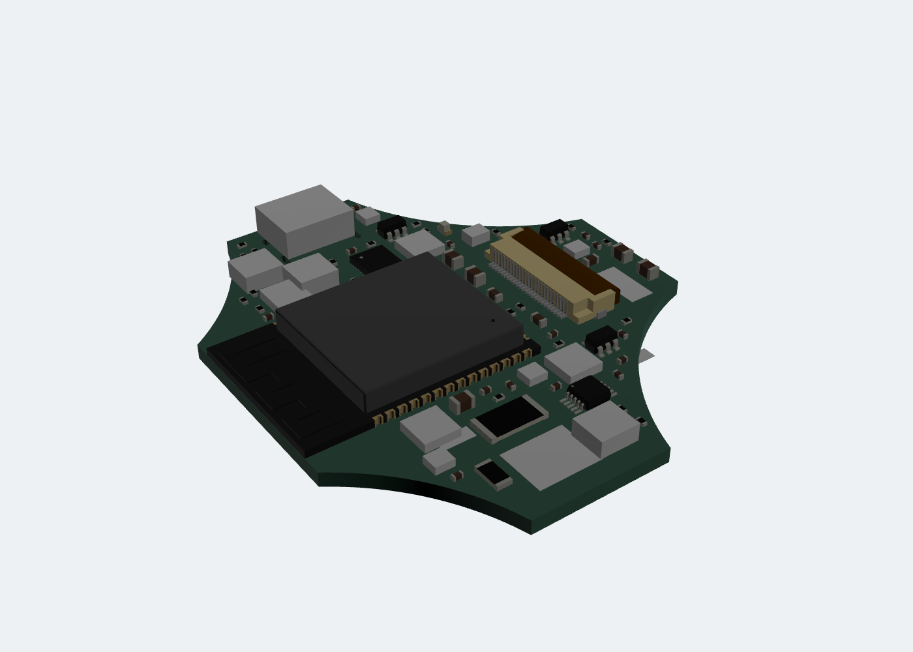
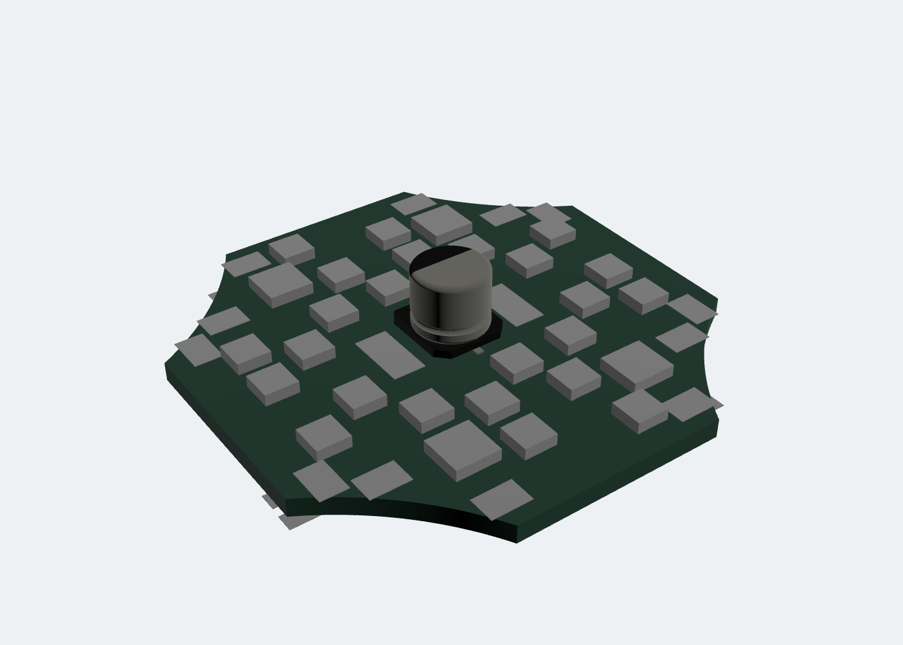
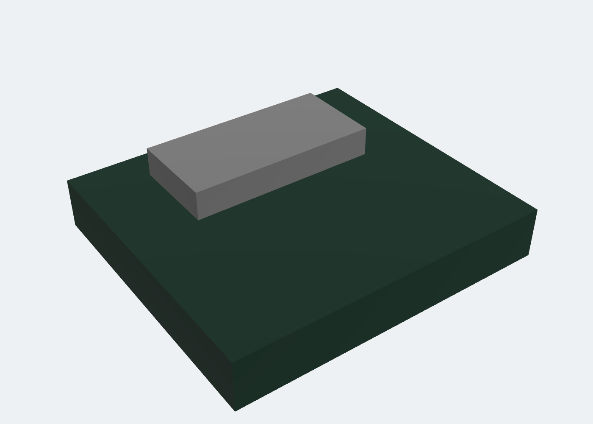
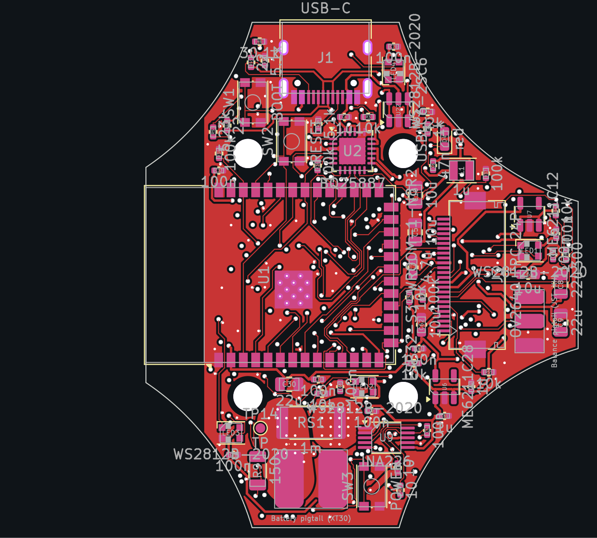
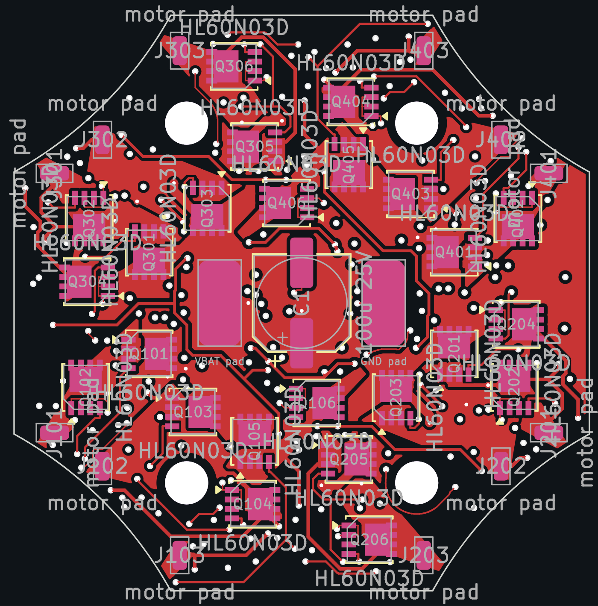
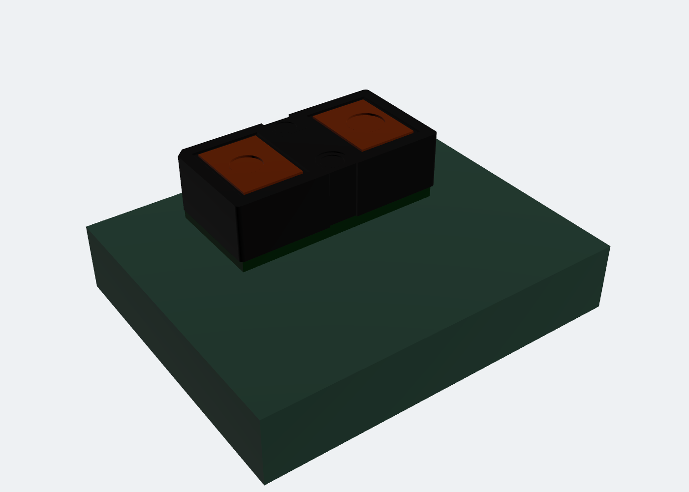

> STATUS: DRAFT - UNVERIFIED - requires human review at Gate G3

# Gate G3 review package - PCB layout

  
  
  
  

| Flight controller (6 layers) | 4-in-1 ESC (4 layers) | ToF satellites (2 layers) |
|---|---|---|
|  |  |  |
|  |  |  |

> [!IMPORTANT]
> **The flight controller and the ESC are not fully routed.** KiCad's DRC lists **29 open connections on the flight controller** and **51 on the ESC** (most ESC items appear twice, because channels 3 and 4 are copies of 2 and 1). Every one is listed in [`open-connections.md`](open-connections.md). Both ToF satellites are fully routed with 0 DRC errors.
>
> **The ESC is also not electrically ready:** its motor-phase copper is far too narrow for motor current (see "Motor-phase copper" below), so it needs a power-stage rework before G4.
>
> **To approve:** reply `APPROVED G3`, or send corrections and answers to OQ-19 to OQ-23 below. Approving G3 with open connections means accepting one of the routes in OQ-19 to finish them before G4.

G2 was approved on 2026-10-08 (D-059). The agent has **stopped at G3**. Fabrication outputs (G4) wait for `APPROVED G3`.

Nothing here has been built, powered or tested. The layouts are drafts produced by scripts and an autorouter. Every value is a datasheet value or an estimate, and anything not checked is marked UNCONFIRMED.

## The boards

| Board | File | Layers | Parts | DRC violations | Unconnected | Vias | Track length | Nets with routed copper |
|---|---|---:|---|---:|---:|---:|---:|---:|
| Flight controller | `hardware/drone-pcb/microscout-fc.kicad_pcb` | 6 | 158 (65 top, 93 bottom) | 30 | 29 | 355 | 3.40 m | 98 |
| 4-in-1 ESC | `hardware/esc-pcb/microscout-esc.kicad_pcb` | 4 | 210 (39 top, 171 bottom) | 2 | 51 | 281 | 2.42 m | 110 |
| ToF side satellite (x3) | `hardware/tof-satellites/side/microscout-tof-side.kicad_pcb` | 2 | 5 (1 top, 4 bottom) | 0 | 0 | 5 | 0.04 m | 5 |
| ToF front satellite | `hardware/tof-satellites/front/microscout-tof-front.kicad_pcb` | 2 | 10 (1 top, 9 bottom) | 0 | 0 | 10 | 0.11 m | 8 |

"DRC violations" are KiCad's counts of errors and warnings together. Breakdown: flight controller: 0 clearance errors, 29 open connections, 24 dangling track stubs and 2 dangling vias left where tracks were removed (warnings), 4 silkscreen lines clipped at the board edge (warnings); ESC: 0 clearance errors, 51 open connections, 2 dangling vias (warnings); satellites: 0.

Part counts leave out the four mounting holes on each board. Track length, vias and nets are counted from the board files (`tools/pcb/g3_report.py`). The pad nets of both boards were checked against the G2 netlists pin by pin: 573 pins on the FC and 678 on the ESC, with 0 mismatches.

## What is in this package (the brief's G3 list)

| Item | File | Review time |
|---|---|---|
| Layer-by-layer exports (SVG per layer, PDF of all copper) | `fc/`, `esc/`, `tof-side/`, `tof-front/`: `*-F_Cu.svg` ... `*-layers.pdf` | 30 min |
| 3D renders, top, bottom and angled | `*/<board>-3d-top.png`, `-3d-bottom.png`, `-3d-angle.png` | 5 min |
| DRC reports | `drc/*.rpt` (KiCad 7 `WriteDRCReport`), summary in `drc/*.json` | 10 min |
| Open connections | `open-connections.md` | 10 min |
| Stackup | `stackup.md` | 5 min |
| Trace widths for the battery and motor currents (formula and measured copper) | `trace-widths.md` | 10 min |
| Antenna keep-out, USB pair, IMU placement | this file, below | 10 min |
| Every autorouted net | `autorouted-nets.md` | 15 min |
| Board files | `hardware/drone-pcb/microscout-fc.kicad_pcb`, `hardware/esc-pcb/microscout-esc.kicad_pcb`, `hardware/tof-satellites/*/microscout-tof-*.kicad_pcb` | - |
| Layout scripts | `tools/pcb/` ([README](../../tools/pcb/README.md)) | - |
| Decisions D-060 to D-064 | `../../docs/decisions.md` | 10 min |

The grey blocks in the 3D renders are size envelopes for parts with no 3D model in KiCad 7's library (ESTIMATES, listed in `tools/pcb/render3d.py`). They are not the real parts.

## Changes since G2

- **D-060: bigger boards** (your choice on 2026-10-08). The flight controller grew to 52 mm square minus four duct notches, with the rear edge cut flush with the ESP32 antenna; the ESC grew to 40 mm square minus notches. Both use a new 16 x 25 mm M2 soft-mount pattern. The frame tray and canopy follow at G5.
- **D-061: slimmer connectors.** This revises the G2 schematics. The regenerated PDFs and netlists are in `../G2/`.

  | Part | G2 | G3 |
  |---|---|---|
  | FC J2 battery | XT30 board connector | Pads for a bought XT30 pigtail on 18 AWG |
  | FC J6 balance | JST-XH board connector | Pads for a bought JST-XH pigtail on 26 AWG |
  | FC SW1-SW3 | TS-1187A | KMR2-footprint switches (4.2 x 2.8 mm; LCSC part UNCONFIRMED) |
  | FC J8/J9, ESC J2/J3 power pads | 5 x 10 mm | 3 x 6 mm (20 AWG) |
  | FC J4, J5, J10-J14, satellite J1 | 1.27 mm through-hole headers | SMD pad rows at 1.5 mm pitch |
- **D-062: the flight controller has 6 layers.** On 4 layers the autorouter left 24 connections open even while running tracks through the L2 ground plane, and 66 once the plane was kept solid. See `stackup.md`.
- **D-063: ESC layout method.** All parts sit at right angles. Channel 3 is an exact 180-degree copy of channel 2 and channel 4 of channel 1, copper included. Each MCU sits beside its gate driver, posed so the six PWM lines need no crossings. Motor-phase copper is a pour added after routing.
- **D-064: finishing router.** `tools/pcb/finisher.py` routes what Freerouting leaves open, on a 0.02 mm grid with exact clearances, and rejects any route that breaks a clearance. It removes tracks that Freerouting put on the GND plane layers or through the battery-path islands and routes them again.
- **Weight:** the larger boards (measured outline areas: FC 1653 mm², ESC 1318 mm²) and 6-layer copper put the estimate at **86.2 g** (75.0-102.4 g), just over the ~85 g limit (OQ-11 at G1). `../G1/budgets.md` is regenerated, and the simulator and Flight Lab use the new mass.

## Antenna keep-out (flight controller)

- The ESP32-S3-WROOM-1 sits on the top side with its antenna end flush with the rear board edge (x = -18.5 mm). Espressif's layout guidance asks for the antenna to sit at the board edge with no copper under or around it.
- A rule area (no tracks, vias or pours on all six layers) covers everything behind x = -12.5 mm, which is the end of the module's pin field. The module footprint's own keep-out only covered three layers, so the first G3 draft had a 3.3 V pour under the antenna on an inner layer. That is fixed.
- The four mounting holes, the battery pigtail and the camera FPC are all ahead of the antenna. The carbon or metal parts of the frame near the antenna are a G5 check.
- Check in the layer plots: no copper behind x = -12.5 mm on any layer (`fc/microscout-fc-*_Cu.svg`).

## USB pair (flight controller)

See `stackup.md`. USB 2.0 Full Speed (12 Mbit/s) does not need controlled impedance at these lengths. The USB-C connector is on the left edge with the USBLC6-2 protector about 9 mm away (centre to centre). Freerouting has no differential-pair support, so D+ and D- were routed as separate 0.2 mm nets, and the result is not good practice: connector to protector is about 25 mm per line, mostly on L1; protector to module is about 36 to 38 mm per line, mostly on L4 (over the L5 GND plane); each line has 4 or 5 vias in total, and the two lines do not run side by side. Full Speed is expected to tolerate this, but it is UNCONFIRMED. **Recommendation:** re-route the pair by hand as a coupled pair on L1, connector to protector to module, when the open connections are finished (OQ-19).

## IMU placement (flight controller)

- **ICM-42688-P (U12)** is on the bottom side next to the board centre, at (1, 0) mm. The centre of the frame moves least in a flip, and the IMU is as far as the board allows from the vibration of all four motors.
- Measured from the board file: its centre is 14 mm or more from the centre of every switching inductor (L1-L4), about 13 mm from the nearest copper of the 30 A battery path, and about 8 mm from the nearest thin battery-voltage track (a low-current branch).
- It is under the module, with solid GND planes (L2 and L5) between it and the module's RF and digital traffic.
- The **magnetometer (U14)** is at the rear left on the bottom, (-7, -7) mm, on the side away from the battery path and the ESC power pads on the right. Its readings near 30 A of battery current are still UNCONFIRMED until G6.
- The **barometer (U13)** is on the bottom near the centre. Prop wash and light both affect a barometer; the canopy foam is a G5 item.
- Soft-mounting on four grommets (D-030) is the main vibration measure. Whether the IMU sees acceptable vibration is only known from logs at G7.

## Battery path (flight controller)

The 30 A path runs from the XT30 pigtail pads (J2) through the 1 mOhm shunt (RS1) to the ESC power pad (J8), all within about 10 mm. It is a solid copper island on L1, L3, L4 and L6, joined by stitching vias. Freerouting had run 141 track segments of other nets through the islands; those were removed and re-routed around them. Measured narrowest copper per layer from J2 to RS1: 4.6, 5.2, 5.4 and 2.7 mm (17.9 mm summed). IPC-2221 asks for 5.7 mm on each of the four layers (22.8 mm) for a 20 C rise as a long conductor, or 3.8 mm each (15.2 mm) for 40 C. This path is only about 6 mm long, which helps, but the margin is thin. The return goes through the GND pour and the two GND planes. The IPC-2221 widths and the copper actually drawn are in `trace-widths.md`. The temperature rise is UNCONFIRMED and must be measured at G6 (bench, props off, electronic load).

## Motor-phase copper (ESC): not acceptable yet

The measured copper (`trace-widths.md`, generated by `tools/pcb/copper.py`) shows that **the ESC motor phases are not ready for motor current**. Of the six phases measured (channels 1 and 2) from the low-side FET drain to the motor pad, three are only as wide as the 0.25 mm routed track at their narrowest point, two have no continuous copper on either outer layer (their connection runs through vias and inner layers, which were not measured), and one is 2.5 mm wide. IPC-2221 needs about 2.1 mm of 2 oz copper for 9.2 A (20 C rise). The phase pours added after routing were cut up by the logic tracks routed first. Also, the L3 VBAT plane under the power stages is crossed by about 570 mm of signal tracks on L3, so the battery feed to the FETs is weaker than drawn in `stackup.md`.

**Fix before G4:** draw the FET-to-motor-pad copper as fixed, wide copper before any routing, and keep logic tracks off L3 under the power stages. This was the first G3 draft's approach. It was dropped because the pre-drawn copper boxed in the FETs' ground pins; the fix needs a FET orientation that leaves those pins outside the phase copper. **Until then the ESC layout must not be built.**

## Autorouted nets

Almost every connection on these boards was placed by Freerouting 1.9.0 or the finisher. The exceptions are the copper islands and planes drawn by the scripts and the stitching vias. Nothing was routed by hand. The full list per board is in `autorouted-nets.md`. Please treat all of it as unreviewed.

## Open questions for the owner

| # | Question | Agent recommendation |
|---|---|---|
| OQ-19 | **How to finish the boards.** Flight controller: 29 open connections (`open-connections.md`). ESC: 51 open connections, and the motor-phase copper must be redrawn (section above). Options: (a) you finish the open connections in KiCad 9 with the interactive router (push-and-shove); (b) the agent reworks the ESC power stage and keeps iterating on both boards at G3; (c) for the ESC only, use a bought whoop 4-in-1 ESC instead (the OQ-9 fallback) and keep the flight controller. | (b) for the ESC power stage, which needs a design change, not just routing. For the flight controller, (a) is fastest: the open items are short connections around fine-pitch parts, which KiCad's interactive router handles well. The batch tools used here have stopped improving. |
| OQ-20 | **6-layer flight controller (D-062).** About +0.3 g, and a higher board price (UNCONFIRMED until the G4 quote). | Accept. A 4-layer version would need a bigger board or a solid ground plane cut by tracks. |
| OQ-21 | **Charge current.** The BQ25887 input is limited to 0.5 A, which charges the 550 mAh pack in about 2 to 2.5 h. One resistor change gives 1 A (about 1 to 1.5 h) from a USB-C port that offers it. | Keep 0.5 A for the first build; change after the G6 bench test. |
| OQ-22 | **Buzzer drive.** The MLT-5020 buzzer is driven from 5 V through Q3. The rating read at G2 was 3 V (UNCONFIRMED: re-read the datasheet of the part you buy). | Check the datasheet. If it is a 3 V part, add a series resistor (footprint change at G4). |
| OQ-23 | **Estimated land patterns.** The VL53L5CX and MLT-5020 footprints are estimates (`hardware/libraries/microscout.pretty.README.md`). | Replace them from ST DS13754 Fig. 28 and the buzzer datasheet before G4. |

Other items to check, already listed in `../../VERIFY.md`: the camera FPC insertion side; the 0.25 mm via and 0.2 mm module-via price tier at JLCPCB; the ESC copper weights (2 oz outer); the inlet-lip overlap of the FC outline.

## What the agent cannot confirm (G3)

- **DRC in KiCad 9.** KiCad 7 has no command-line DRC; the reports here come from `pcbnew.WriteDRCReport`. Please run KiCad 9's DRC (setup guide step 7) and commit the reports.
- **Land patterns against the parts you buy** (pin 1, exposed pads, the two estimated footprints).
- **Fabricator rules and prices** for 6 layers, 0.25 mm vias and 2 oz copper (G4 quote).
- **Current capacity and temperature** of the battery and motor copper (G6 measurement).
- **RF performance** of the antenna in the frame (G6/G7).
- **Mechanical fit** of the new outlines in the frame (G5).

The G3 checklist is in `../../VERIFY.md`.
